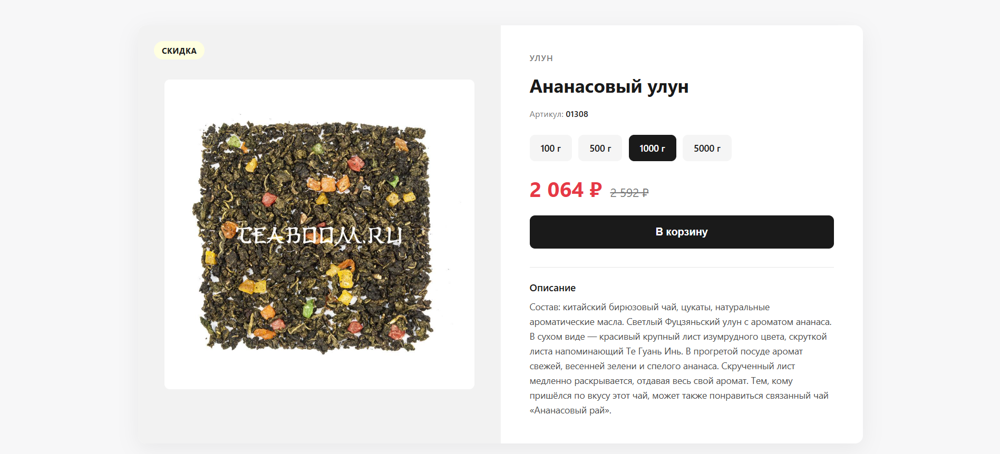

## Установка
1. Склонируйте репозиторий или скачай файлы проекта.
2. Перейдите в папку проекта.
3. Установите зависимости:<br/>
cmd 
```npm install```
## Запуск
### 1. Режим разработки
cmd
```npm run watch```<br/>
Терминал остаётся открытым и следит за styles.scss. Каждый раз при сохранении автоматически обновляется styles.css.

### 2. Разовая сборка
cmd
```npm run build```<br/>
Создаёт оптимизированный styles.css для продакшена.

## Открыть проект в браузере
Просто откройте index.html двойным кликом.

## Демонстрационные изображения

<div align="center">
  
</div>
